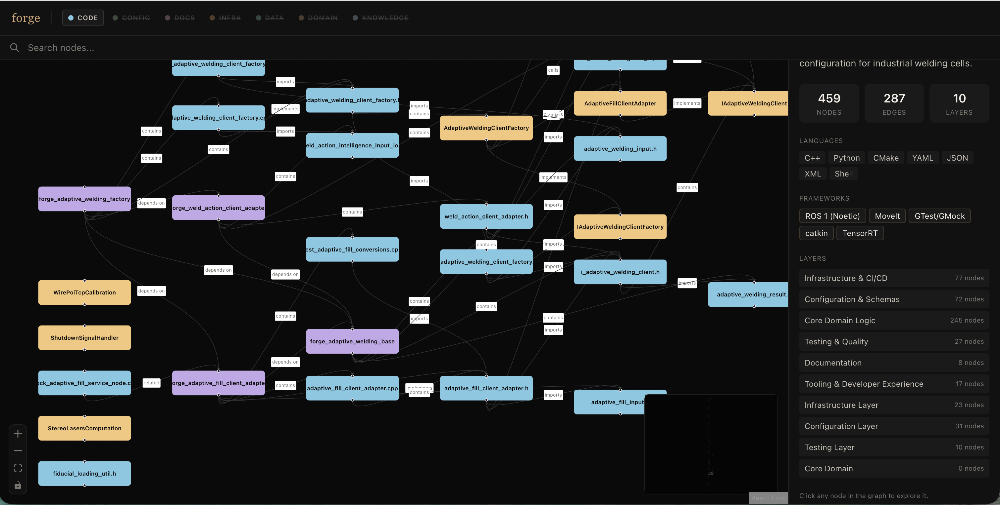

# Codescape

Analyze any codebase and explore it as an interactive knowledge graph. Claude reads your files, maps the architecture, and serves a navigable React Flow dashboard — no API key required.

---

## Quick start

**Prerequisites:** [Claude Code](https://claude.ai/code) + [Docker Desktop](https://www.docker.com/products/docker-desktop/)

```bash
git clone https://github.com/Santayan-Path/codescape.git
cd codescape

# Install the Claude Code commands (one-time)
./install-skill.sh

# Build the Docker image for the dashboard (one-time, ~2 min)
docker compose build
```

Then in any Claude Code session:

```
/codescape /path/to/your/project
/codescape-dashboard /path/to/your/project
```

Open **http://localhost:3141**. Done.



---

## Example — analyzing an existing project

Say you have a repo at `~/projects/my-api` and want to understand its architecture.

**Step 1 — Install Codescape (one-time, from anywhere in your terminal):**

```bash
~/path/to/codescape/install-skill.sh
cd ~/path/to/codescape && docker compose build
```

**Step 2 — Open Claude Code inside your project:**

```bash
cd ~/projects/my-api
claude
```

**Step 3 — Run the analysis:**

```
/codescape
```

Claude scans every file, maps imports, calls, and dependencies, and saves the graph to `~/projects/my-api/.codescape/knowledge-graph.json`. Takes ~5–20 minutes depending on project size.

**Step 4 — Open the dashboard:**

```
/codescape-dashboard
```

Opens the interactive graph at **http://localhost:3141**. Click any node to see its summary, tags, complexity, and relationships. Use the search bar to jump to any file, class, or function.

**Step 5 — Stop the dashboard when done:**

```bash
docker stop codescape-dashboard
```

**To re-analyze after making code changes:**

```
/codescape --full
```

---

## What it produces

`.codescape/knowledge-graph.json` — a validated graph of nodes (files, classes, functions, services, configs, …) and typed edges (imports, calls, depends_on, …) grouped into logical layers. The dashboard visualizes it as an interactive canvas with search, filtering, and a detail sidebar.

---

## Three ways to run

| Option | Best for | Requires |
|---|---|---|
| **Claude Code skill** | No API key — Claude does the analysis | Claude Code + Docker |
| **Docker** | Fully isolated, no local setup | Docker + Anthropic API key |
| **Standalone CLI** | Scripting, CI, automation | Node.js 22+ + API key or Claude Code |

---

## Option A — Claude Code skill (recommended)

Claude reads your files and produces the graph directly inside the session — no API key consumed. The dashboard is served from the pre-built Docker image so Node.js is never needed.

### Setup (one-time)

```bash
./install-skill.sh          # installs /codescape and /codescape-dashboard globally
docker compose build        # builds the dashboard image
```

### Usage

```
/codescape                              # analyze current directory
/codescape /path/to/project            # analyze a specific project
/codescape /path/to/project --full     # force full rebuild
```

```
/codescape-dashboard                   # open dashboard for current directory
/codescape-dashboard /path/to/project  # open dashboard for a specific project
```

To stop the dashboard: `docker stop codescape-dashboard`

### How it works

<details>
<summary>Internals</summary>

1. Scans the project with `git ls-files` (or `find`) — no Node.js needed
2. Reads files in batches of 25 using Claude's `Read` tool
3. Writes each batch's graph fragment to a temp file
4. Runs `merge-graph.py` (Python 3) to merge all fragments and save the final graph instantly
5. Serves the dashboard via Docker

**Claude is the LLM** — no API key consumed. Python handles the merge so Claude never generates thousands of lines of JSON at once.

</details>

---

## Option B — Docker (requires Anthropic API key)

Fully self-contained — no Claude Code, no Node.js. The LLM calls go via the Anthropic API.

### Setup

```bash
cp .env.example .env
# Edit .env: set ANTHROPIC_API_KEY and PROJECT
docker compose build
```

### Usage

```bash
docker compose run --rm analyze          # analyze $PROJECT, write graph
docker compose up dashboard              # serve dashboard at http://localhost:3141
docker compose run --rm --service-ports full  # analyze + serve in one command
```

Switch projects on the fly:

```bash
PROJECT=/path/to/other/repo docker compose run --rm analyze
PROJECT=/path/to/other/repo docker compose up dashboard
```

---

## Option C — Standalone CLI (requires Node.js ≥ 22)

```bash
pnpm install && pnpm build:core
```

LLM backend priority: `claude --print` (inside Claude Code) → `ANTHROPIC_API_KEY` (env var).

```bash
# Inside Claude Code — no API key needed
! pnpm analyze analyze /path/to/project

# Outside Claude Code
export ANTHROPIC_API_KEY=sk-ant-...
pnpm analyze analyze /path/to/project --open
```

Dashboard:

```bash
GRAPH_DIR=/path/to/project/.codescape pnpm dev:dashboard   # dev mode
node cli/dist/index.js serve /path/to/project               # production serve
```

---

## Dashboard features

| Feature | How |
|---|---|
| **Node graph** | dagre-layout React Flow canvas — drag, zoom, pan |
| **Node detail** | Click any node → sidebar shows summary, tags, complexity, edges |
| **Search** | Fuse.js fuzzy search across node names, summaries, and tags |
| **Filter by type** | Toggle Code / Config / Docs / Infra / Data / Domain / Knowledge |
| **Project overview** | Stats, language list, framework list, layer breakdown |

---

## Repo structure

```
codescape/
├── packages/
│   ├── core/                # Schema (Zod), types, search (Fuse.js), persistence
│   └── dashboard/           # React 19 + React Flow + Tailwind v4 UI
├── cli/                     # Standalone CLI — analyze / serve
├── skills/
│   ├── codescape/           # /codescape command + merge-graph.py
│   └── codescape-dashboard/ # /codescape-dashboard command
├── install-skill.sh         # One-command installer
├── Dockerfile               # Multi-stage build
├── docker-compose.yml       # analyze / dashboard / full services
└── .env.example             # Environment variable template
```

---

## Knowledge graph schema

<details>
<summary>Full schema reference</summary>

```json
{
  "version": "1.0.0",
  "kind": "codebase",
  "project": {
    "name": "my-project",
    "languages": ["TypeScript", "Python"],
    "frameworks": ["React", "FastAPI"],
    "description": "...",
    "analyzedAt": "2026-05-27T12:00:00.000Z",
    "gitCommitHash": ""
  },
  "nodes": [
    {
      "id": "src/auth.ts",
      "type": "file",
      "name": "auth.ts",
      "filePath": "src/auth.ts",
      "summary": "JWT authentication middleware and token utilities.",
      "tags": ["auth", "jwt", "middleware"],
      "complexity": "moderate"
    }
  ],
  "edges": [
    {
      "source": "src/index.ts",
      "target": "src/auth.ts",
      "type": "imports",
      "direction": "forward",
      "weight": 0.8
    }
  ],
  "layers": [
    {
      "id": "api-layer",
      "name": "API Layer",
      "description": "HTTP endpoints and routing",
      "nodeIds": ["src/routes/users.ts", "src/routes/auth.ts"]
    }
  ],
  "tour": []
}
```

**21 node types:** `file`, `function`, `class`, `module`, `concept`, `config`, `document`, `service`, `table`, `endpoint`, `pipeline`, `schema`, `resource`, `domain`, `flow`, `step`, `article`, `entity`, `topic`, `claim`, `source`

**35 edge types** across 8 categories: structural, behavioral, data flow, dependencies, semantic, infrastructure, domain, knowledge

</details>

---

## Development

```bash
pnpm build:core       # packages/core → dist/
pnpm build:cli        # cli/ → dist/
pnpm build:dashboard  # packages/dashboard → dist/
pnpm --filter @codescape/core test
```

---

## License

MIT
